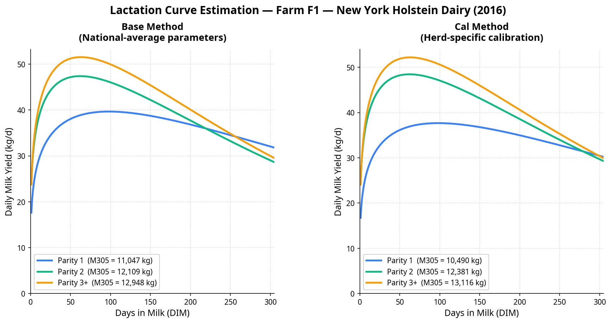

# Herd-Specific Lactation Curve Estimation (RuFaS Module)

This repository contains a standalone Python module from the **Ruminant Farm Systems (RuFaS) model**, adapted for educational purposes. It demonstrates a key component of RuFaS: how the model predicts lactation curves for dairy cows and how we can improve prediction accuracy by calibrating the model to a specific farm.

This script is designed to be run as a live demonstration for an undergraduate class. It compares two methods for generating lactation curves:

1.  **The Base Method**: Uses national-average parameters from published literature. This is what RuFaS does when it has no specific information about a farm.
2.  **The Calibrated (Cal) Method**: Uses three simple pieces of real farm data—annual milk production, herd size, and parity structure—to create a herd-specific curve. This method, developed by Gong et al. (2025), reduces prediction error from over 40% down to just 2% [1].

## Quickstart: Running the Demo

Get this running in three steps from your terminal.

### Step 1: Clone the Repository

```bash
git clone https://github.com/YijingGong/Herd-specific-lactation-curve.git
cd Herd-specific-lactation-curve
```

### Step 2: Install Dependencies

This script requires a few common scientific Python packages. Install them using the `requirements.txt` file.

```bash
pip install -r requirements.txt
```

### Step 3: Run the Python Script

Execute the script directly. It will run a pre-configured demo using data from a real New York dairy farm.

```bash
python herd_specific_lactation_curve.py
```

## Understanding the Output

The script will produce two things:

**1. Detailed Console Output:**

You will see a step-by-step calculation for both the Base and Calibrated methods, showing the Wood's curve parameters (`a`, `b`, `c`) and the final predicted 305-day milk yield (M305) for each parity group.

```
=================================================================
  COMPARISON SUMMARY  —  Predicted M305 (kg per cow per 305 d)
=================================================================
  Parity             Base Method        Cal Method
  ------------  ----------------  ----------------
  Parity 1              11,047 kg          10,490 kg
  Parity 2              12,109 kg          12,381 kg
  Parity 3+             12,948 kg          13,116 kg
```

**2. A Comparison Plot (`lactation_curve_comparison.png`):**

The script will automatically generate and save a PNG file in your directory. This plot visually shows the dramatic difference between the two methods.



## Try It Yourself!

Open `herd_specific_lactation_curve.py` in a text editor and scroll to the bottom `if __name__ == "__main__":` section.

Try changing the input variables for the demo farm. For example:

-   What happens if the herd's **Annual Herd Milk Production (`AHMP`)** was `20,000,000` kg/yr instead of `18,405,332`?
-   What if the herd was smaller, with only **`800` milking cows**?

Re-run the script (`python herd_specific_lactation_curve.py`) and see how the console output and the plot change!

## References

[1] Gong, Y., H. Hu, K. F. Reed, G. J. M. Rosa, and V. E. Cabrera. 2025. Herd-specific lactation curve estimation for the Ruminant Farm Systems model. J. Dairy Sci. *In Press*. https://doi.org/10.3168/jds.2024-25809

[2] Li, M., G. J. M. Rosa, K. F. Reed, and V. E. Cabrera. 2022. Investigating the effect of temporal, geographic, and management factors on US Holstein lactation curve parameters. J. Dairy Sci. 105:7525–7538. https://doi.org/10.3168/jds.2022-21882

---

For questions, please contact Yijing Gong (gong44@wisc.edu) or Haowen Hu (hh598@cornell.edu).
